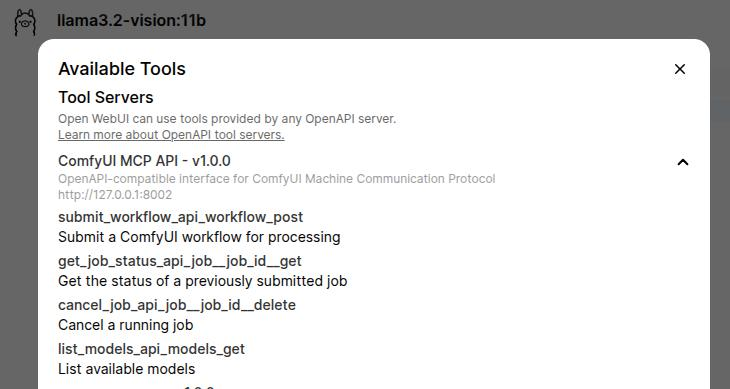

# ComfyUI MCP Server

A lightweight Python-based MCP (Model Context Protocol) server that interfaces with a local [ComfyUI](https://github.com/comfyanonymous/ComfyUI) instance to generate images programmatically via AI agent requests.

## Overview

This branch has been adapted to include **OpenAPI compatibility** using the FastAPI framework. It provides a RESTful API interface for interacting with ComfyUI, enabling easier integration with external systems and tools. Key features include:
- Flexible workflow selection (e.g., `basic_api_test.json`).
- Dynamic parameters: `prompt`, `width`, `height`, and `model`.
- OpenAPI documentation and schema generation.
- Returns image URLs served by ComfyUI.

## Prerequisites

- **Python 3.10+**
- **ComfyUI**: Installed and running locally (e.g., on `localhost:8188`).
- **Dependencies**: `fastapi`, `uvicorn`, `pydantic`, `requests`, `websockets`, `mcp` (install via pip).

## Setup

1. **Clone the Repository**:
   ```bash
   git clone <your-repo-url>
   cd comfyui-mcp-server
   ```

2. **Install Dependencies**:
   ```bash
   pip install fastapi uvicorn pydantic requests websockets mcp
   ```

3. **Start ComfyUI**:
   - Install ComfyUI (see [ComfyUI docs](https://github.com/comfyanonymous/ComfyUI)).
   - Run it on port 8188:
     ```bash
     cd <ComfyUI_dir>
     python main.py --port 8188
     ```

4. **Prepare Workflows**:
   - Place API-format workflow files (e.g., `basic_api_test.json`) in the `workflows/` directory.
   - Export workflows from ComfyUI’s UI with “Save (API Format)” (enable dev mode in settings).

## Usage

1. **Run the OpenAPI MCP Server**:
   ```bash
   python openapi_server.py
   ```

   - The server will listen on `http://localhost:8002`.
   - OpenAPI documentation is available at:
     - Swagger UI: `http://localhost:8002/docs`
     - ReDoc: `http://localhost:8002/redoc`

2. **Test Endpoints**:
   - Use tools like `curl`, Postman, or the FastAPI interactive docs to test the API.
   - Example: Submit a workflow:
     ```bash
     curl -X POST "http://localhost:8002/api/workflow" \
     -H "Content-Type: application/json" \
     -d '{
         "workflow": {"nodes": [...]},
         "inputs": {"prompt": "a dog wearing sunglasses"}
     }'
     ```

3. **Custom Requests**:
   - Modify the payload to change `prompt`, `width`, `height`, `workflow_id`, or `model`.

4. **Using with OpenWebUI**:
   - OpenWebUI can be configured to interact with this server for workflow execution.
   - Follow these steps:
     1. Ensure OpenWebUI is installed and running.
     2. Add the MCP server as a custom backend in OpenWebUI:
        - Navigate to the **Settings** page in OpenWebUI.
        - Under the **Custom Backend** section, add the MCP server URL:
          ```
          http://localhost:8002
          ```
        - Save the settings.
     3. Use OpenWebUI’s interface to send requests to the MCP server.
     4. Select workflows, adjust parameters (e.g., `prompt`, `width`, `height`), and submit jobs directly from OpenWebUI.

### Tools Available in OpenWebUI

Once configured, the following tools will be available in OpenWebUI:

1. **`submit_workflow_api_workflow_post`**  
   Submit a ComfyUI workflow for processing.

2. **`get_job_status_api_job__job_id__get`**  
   Get the status of a previously submitted job.

3. **`cancel_job_api_job__job_id__delete`**  
   Cancel a running job.

4. **`list_models_api_models_get`**  
   List available models.



## Project Structure

- `openapi_server.py`: OpenAPI-compatible MCP server using FastAPI.
- `comfyui_client.py`: Interfaces with ComfyUI’s API, handles workflow queuing.
- `client.py`: Test client for sending MCP requests.
- `workflows/`: Directory for API-format workflow JSON files.

## Notes

- Ensure your chosen `model` (e.g., `v1-5-pruned-emaonly.ckpt`) exists in `<ComfyUI_dir>/models/checkpoints/`.
- The MCP SDK lacks native WebSocket transport; this uses a custom implementation.
- For custom workflows, adjust node IDs in `comfyui_client.py`’s `DEFAULT_MAPPING` if needed.

## Contributing

Feel free to submit issues or PRs to enhance flexibility (e.g., dynamic node mapping, progress streaming).

## License

Apache License